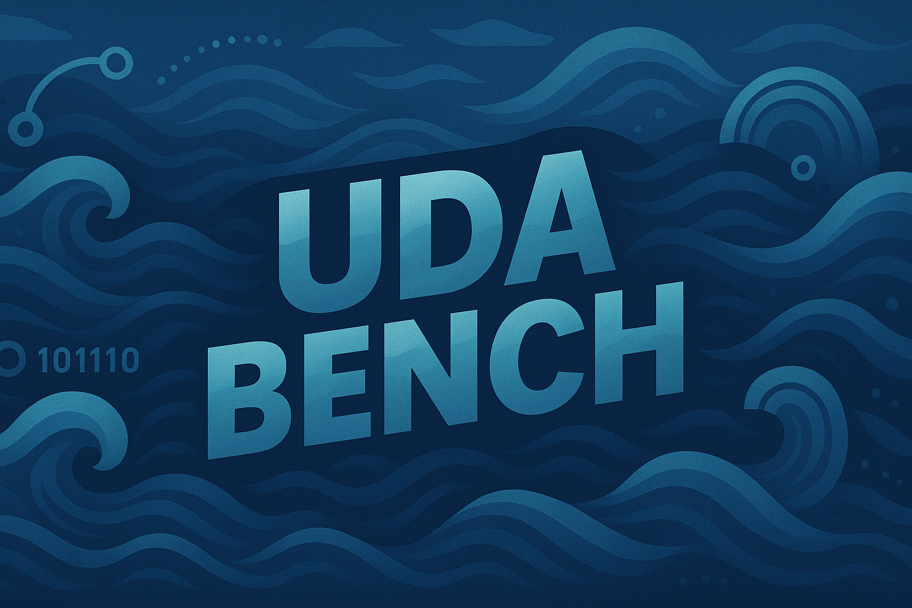
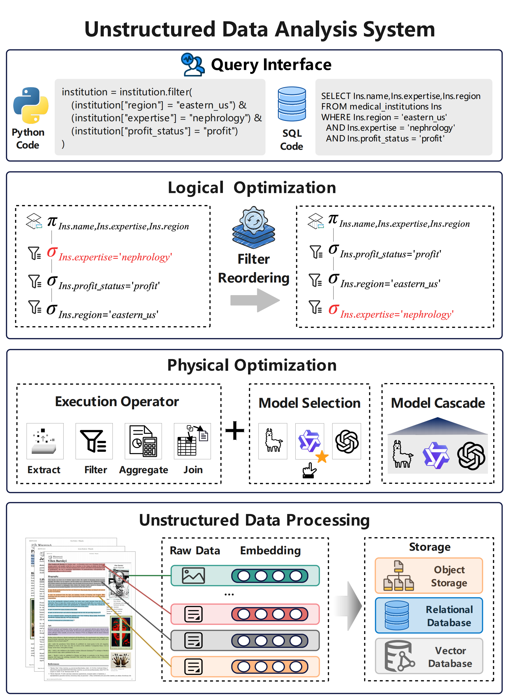

# 📊 Unstructured Data Analysis Benchmark


[](https://opensource.org/licenses/MIT)
[](https://www.python.org/)
[](https://github.com/example/datasets)
[](https://github.com/example/systems)

<div align="center">
  
  <br>
</div>

## 🎯 Project Overview

Nowadays, the explosion of unstructured data presents immense analytical value. Leveraging the remarkable capability of large language models (LLMs) in extracting attributes of structured tables from unstructured data, researchers are developing LLM-powered data systems for users to analyze unstructured documents as working with a database. These unstructured data analysis (UDA) systems differ significantly in all aspects, including query interfaces, query optimization strategies, and operator implementations, making it unclear which performs best in which scenario. Unfortunately, there does not exist a comprehensive benchmark that offers high-quality, large-volume, and diverse datasets as well as rich query workload to thoroughly evaluate such systems.

To fill this gap, we present **Unstructured Data Analysis Benchmark**, the first benchmark for unstructured data analysis that meets all the above requirements. Specifically, we organize a team with 30 graduate students that spends over in total 10,000 hours on curating 5 datasets from various domains and constructing a *relational database view* from these datasets by manual annotation. These relational databases can be used as ground truth to evaluate any of these UDA systems despite their differences in programming interfaces. Moreover, we design diverse queries to analyze the attributes defined in the database schema, covering different types of analytical operators with varying selectivities and complexities. We conduct in-depth analysis of the key building blocks of existing UDA systems: query interface, query optimization, operator design, and data processing. We run exhaustive experiments over the benchmark to fully evaluate these systems and different techniques w.r.t. the above building blocks. The major outcomes of this project, including (1) a comprehensive benchmark that allows a rigorous evaluation of UDA systems and (2) a deep understanding of the strengths and limitations of existing systems, pave the way for future research of unstructured data analysis.

This is a comprehensive benchmark system for unstructured document analysis, designed to evaluate the performance of various document understanding and information extraction systems. The benchmark includes 5 datasets from different domains, covering various document types from simple structured to complex multimodal content.

<div align="center">
  
  <br>
  <em>Figure 1: System architecture showing the query interface, logical optimization, physical optimization, and unstructured data processing pipeline.</em>
</div>

## 📈 Dataset Statistics

| Dataset | # Attributes | # Files | Tokens (Max/Min/Avg) | Multi-modal |
|---------|--------------|---------|----------------------|-------------|
| WikiArt | 19 | 1,000 | 1,665 / 619 / 789 | ✓ |
| NBA | 28 | 225 | 51,378 / 73 / 8,047 | ✗ |
| LCR | 19 | 566 | 45,437 / 340 / 5,609 | ✗ |
| Finance | 30 | 100 | 838,418 / 7,162 / 130,633 | ✓ |
| Healthcare | 51 | 100,000 | 63,234 / 2,759 / 10,649 | ✗ |


## 💾 Data Access

[](https://github.com/example/datasets)
[](https://github.com/example/datasets)

Due to the large size of our datasets, we provide access through download links rather than storing them directly in the repository.

### Dataset Downloads

| Dataset | Size | Download Link | Ground Truth |
|---------|------|---------------|--------------|
| NBA | ~2.43MB | [Download NBA Dataset](https://drive.google.com/drive/folders/1SJlRi0xyDxghbIf87Us7G2Q8C1Baoc34?usp=drive_link) | [Download Ground Truth](https://drive.google.com/drive/folders/11BLcF42xbshAMTGkq6yjtsn_PWo3xvei?usp=drive_link) |
| WikiArt | ~379MB | [Download WikiArt Dataset](https://drive.google.com/drive/folders/1BlymFgt_ft0qKaylae5v2HvoXZ8iM5lY?usp=drive_link) | [Download Ground Truth](https://drive.google.com/drive/folders/11BLcF42xbshAMTGkq6yjtsn_PWo3xvei?usp=drive_link) |
| LCR | ~304MB | [Download LCR Dataset](https://drive.google.com/drive/folders/1blpgfHjoXlz_Jl6EboqN-657IpxBL81c?usp=drive_link) | [Download Ground Truth](https://drive.google.com/drive/folders/11BLcF42xbshAMTGkq6yjtsn_PWo3xvei?usp=drive_link) |
| Finance | ~413.6MB | [Download Finance Dataset](https://drive.google.com/drive/folders/1cW1iIBqTsUm_r5NexLJ4FCIeuGGJ8D6S?usp=drive_link) | [Download Ground Truth](https://drive.google.com/drive/folders/11BLcF42xbshAMTGkq6yjtsn_PWo3xvei?usp=drive_link) |
| Healthcare | ~5.16MB | [Download Healthcare Dataset](https://drive.google.com/drive/folders/1jv29X8I9VZAbrsTfWa13rqC2QvSY3C0V?usp=drive_link) | [Download Ground Truth](https://drive.google.com/drive/folders/11BLcF42xbshAMTGkq6yjtsn_PWo3xvei?usp=drive_link) |


## 📚 Dataset Details

### 🏀 NBA Dataset
- **Source**: Wikipedia
- **Content**: NBA players, teams, team owners, and other information from the 20th century to present, covering basic information and statistics such as player personal honors, team founding year, owner nationality, etc.
- **Characteristics**: Relatively simple structure, containing player personal honors, team founding year, owner nationality, and other information

### 🎨 WikiArt Dataset
- **Source**: WikiArt.org
- **Content**: Artists and their artworks spanning from the 19th to 21st centuries
- **Characteristics**: Multimodal dataset containing biographical information, artistic movements, representative works lists, and high-resolution images

### ⚖️ LCR (Legal Cases) Dataset
- **Source**: AustLII
- **Content**: 570 professional legal cases from Australia between 2006-2009
- **Characteristics**: Domain-specific dataset containing different types such as criminal and administrative cases, requiring semantic reasoning to extract attributes

### 💰 Finance Dataset
- **Source**: Enterprise RAG Challenge
- **Content**: Annual and quarterly financial reports published in 2022 by 100 listed companies worldwide
- **Characteristics**: Extremely long documents (average 130,633 tokens), containing mixed content types such as company name, net profit, total assets, etc.

### 🏥 Healthcare Dataset
- **Source**: MMedC
- **Content**: Large number of healthcare documents since 2020
- **Characteristics**: Largest scale dataset containing drugs, diseases, medical institutions, news, interviews, and other various healthcare information

## 🔧 Benchmark Construction Process

<div align="center">
  
  <br>
  <em>Figure 2: Overview of the benchmark construction process, showing the four main stages: data collection, attribute definition, ground truth labeling, and query construction.</em>
</div>

### 1. 📥 Data Collection and Preprocessing
- Collect data from original sources
- Use MinerU toolkit to parse complex formats (such as PDF)
- Organize datasets into JSON format, where each object corresponds to an unstructured document
- For Healthcare and NBA datasets, divide documents into multiple related categories

### 2. 🏷️ Attribute Identification
- Hire 6 Ph.D. students from different majors to carefully read documents
- Identify significant attributes with different extraction difficulties
- Examples: Judge names in legal datasets are easy to identify, while case numbers require full-text search and reasoning

### 3. ✅ Ground Truth Labeling
- Total of 30 graduate students participated in labeling, consuming approximately 10,000 human hours
- Use multiple LLMs (Deepseek-V3, GPT-4.1, Claude-sonnet-4) for cross-validation
- Adopt semi-automated iterative labeling strategy for large-scale datasets

### 4. 🔍 Query Construction
- Experts design query templates based on real-world scenarios
- Support both SQL-like queries and Python code interfaces
- Total of 240 queries created, including 220 single-table queries and 20 multi-table queries

## 🔍 Query Types

The benchmark supports the following query types:
- **📤 Extract**: Simple information extraction
- **🔍 Extract + Filter**: Information extraction with filtering conditions
- **📊 Extract + Aggregate**: Information extraction with aggregation operations
- **🔗 Extract + Join**: Multi-table join queries
- **🔄 Mixture**: Mixed operation queries

## 🚀 Usage Instructions

[](https://github.com/example/quickstart)
[](https://github.com/example/queries)

1. **📥 Download Datasets**: Use the provided download links to obtain the datasets you need
2. **📂 Extract Files**: Unzip the downloaded files to your local directory
3. **💻 Load Data into System**: Load the JSON data into your analysis system
4. **🔍 Execute Queries**: Run the benchmark queries (provided separately)
5. **📊 Compare Results**: Compare your results with the ground truth CSV files

## 🧪 Systems for Evaluation

[](https://github.com/example/systems)
[](https://github.com/example/systems)

Our benchmark evaluates 7 existing unstructured data analysis systems:

| System | Open Source | Repository | Modifications |
|--------|-------------|------------|---------------|
| 📋 Evaporate | ✅ | [GitHub](https://github.com/HazyResearch/evaporate) | [Adaptation](systems/Evaporate) |
| 🐍 Palimpzest (PZ) | ✅ | [GitHub](https://github.com/mitdbg/palimpzest) | [Adaptation](systems/PZ) |
| 🌸 LOTUS | ✅ | [GitHub](https://github.com/lotus-data/lotus) | [Adaptation](systems/Lotus) |
| 🤖 DocETL | ✅ | [GitHub](https://github.com/ucbepic/docetl) | [Direct Usage](systems/DocETL) |
| ❓ QUEST | ✅ | [GitHub](https://github.com/qiyandeng/QUEST) | [Adaptation](https://github.com/example/quest-extension) |
| 🎯 ZenDB | ❌ | [Paper](https://arxiv.org/abs/2405.04674) | [Implementation](systems/ZenDB) |
| 🔍 UQE | ❌ | [Paper](https://arxiv.org/abs/2407.09522) | [Implementation](systems/UQE) |

### System Descriptions:

**📋 Evaporate**: A table extraction system that extracts structured tables from documents, and subsequently executes SQL queries on the resulting tables.

**🐍 Palimpzest (PZ)**: Provides Python API-based operators for unstructured data processing. We convert each SQL query into the corresponding PZ code, execute it and obtain the results.

**🌸 LOTUS**: Provides an open-source Python library for AI-based data processing with indexing, extraction, filtering, and joining capabilities. We use its interface to execute queries.

**🤖 DocETL**: An agentic query rewriting and evaluation system for complex document processing. We directly use the DocETL library to execute queries without any modifications.

**❓ QUEST**: A query engine for unstructured databases that accepts a subset of standard SQL syntax. We directly use their code to execute queries.

**🎯 ZenDB**: A system that constructs semantic hierarchical trees to identify relevant document sections. We implement their SHT chunking and filter reordering strategies.

**🔍 UQE**: A query engine for unstructured databases that supports SQL-like query syntax with sampling-based aggregation capabilities. We implement its filter and aggregate operators, as well as logical optimizations.

For a comprehensive evaluation, we adapted and modified these systems to support our evaluation requirements. Detailed adaptation strategies are provided in the appendix.

### System Capabilities Comparison

<div align="center">

| System                | Query Interface | Chunking | Embedding | Multi-modal | Extract | Filter | Join | Aggregate | Logical Opt. | Physical Opt. |
|------------------------|-----------------|----------|-----------|-------------|---------|--------|------|-----------|--------------|---------------|
| 📋 **Evaporate**       | ❌              | ❌        | ❌         | ❌          | ✅       | ❌      | ❌    | ❌         | ❌            | ❌             |
| 🐍 **Palimpzest (PZ)** | Code            | ❌        | ❌         | ✅          | ✅       | ✅      | ❌    | ❌         | ✅            | ✅             |
| 🌸 **LOTUS**           | Code            | ❌        | ✅         | ✅          | ✅       | ✅      | ✅    | ✅         | ❌            | ✅             |
| 🤖 **DocETL**          | Code            | ✅        | ✅         | ❌          | ✅       | ✅      | ✅    | ✅         | ✅            | ✅             |
| 🎯 **ZenDB**           | SQL-like        | ✅        | ✅         | ❌          | ✅       | ✅      | ✅    | ❌         | ✅            | ❌             |
| ❓ **QUEST**           | SQL-like        | ✅        | ✅         | ❌          | ✅       | ✅      | ✅    | ❌         | ✅            | ❌             |
| 🔍 **UQE**             | SQL-like        | ❌        | ✅         | ❌          | ✅       | ✅      | ❌    | ✅         | ✅            | ❌             |

*Table 1: Overview of existing unstructured data analysis systems and their capabilities.*


</div>

<!-- ### 🏆 System Leaderboard

<div align="center">

| Rank | System | 🏅 Score | 🎯 Strengths | 📊 Capabilities |
|:----:|--------|:--------:|-------------|----------------|
| 🥇 | 🤖 **DocETL** | **9/10** | Full-featured, Comprehensive | All operators + Optimization |
| 🥈 | 🌸 **LOTUS** | **8/10** | Rich operators, Multi-modal | Complete operator set |
| 🥉 | 🐍 **Palimpzest** | **7/10** | Code interface, Multi-modal | Core operators + Optimization |
| 4️⃣ | 🎯 **ZenDB** | **7/10** | SQL interface, Advanced chunking | Most operators + Logical opt. |
| 5️⃣ | ❓ **QUEST** | **7/10** | SQL interface, Good chunking | Most operators + Logical opt. |
| 6️⃣ | 🔍 **UQE** | **6/10** | SQL interface, Aggregation | Core operators + Optimization |
| 7️⃣ | 📋 **Evaporate** | **2/10** | Simple extraction | Basic extract only |

</div>

**🏅 Scoring Criteria:**
- **Query Interface** (1pt): Code/SQL-like interface
- **Data Processing** (2pts): Chunking + Embedding + Multi-modal
- **Operators** (4pts): Extract + Filter + Join + Aggregate  
- **Optimization** (3pts): Logical + Physical optimization

*The leaderboard is based on comprehensive capability analysis across all system modules.* -->


## 📁 File Structure

```
unstractured_analysis_benchmark/
├── README.md          # Project documentation
├── img/              # Project-related images
├── queries/          # Benchmark queries (to be added)
│   ├── nba_queries.sql
│   ├── wikiart_queries.sql
│   ├── lcr_queries.sql
│   ├── finance_queries.sql
│   └── healthcare_queries.sql
├── systems/          # Evaluation systems (to be added)
│   ├── evaporate/    # Evaporate system adaptation
│   ├── palimpzest/   # Palimpzest system adaptation
│   ├── lotus/        # LOTUS system wrapper
│   ├── docetl/       # DocETL system usage examples
│   ├── quest/        # QUEST system extension
│   ├── zendb/        # ZenDB system implementation
│   └── uqe/          # UQE system implementation
└── evaluation/       # Evaluation scripts (to be added)
    ├── evaluate.py
    ├── evaluate_healthcare.py
    ├── evaluate_agg.py
    └── attr_types.json
```

## 🤝 Contributing

We welcome issue reports, feature requests, or code contributions. Please ensure to follow the project's coding standards and testing requirements.

<!-- ## 📄 License

[License information to be added] -->

<!-- ## 📚 Citation

If you use this benchmark in your research, please cite our paper:

```bibtex
[Citation format to be added]
``` -->

## 📧 Contact

For questions or suggestions, please contact us through:
- Submit GitHub Issues
- Send email to: [Email to be added]

---

*Last updated: 2024*
